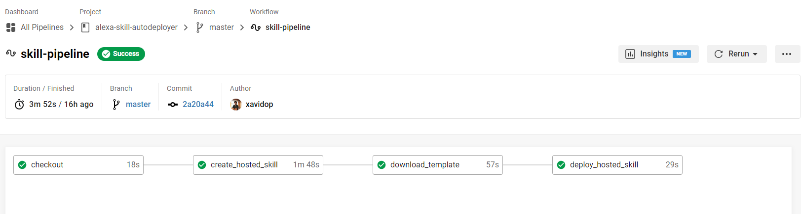
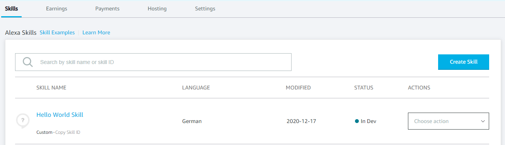
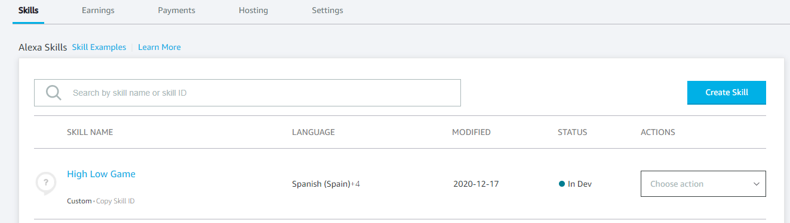
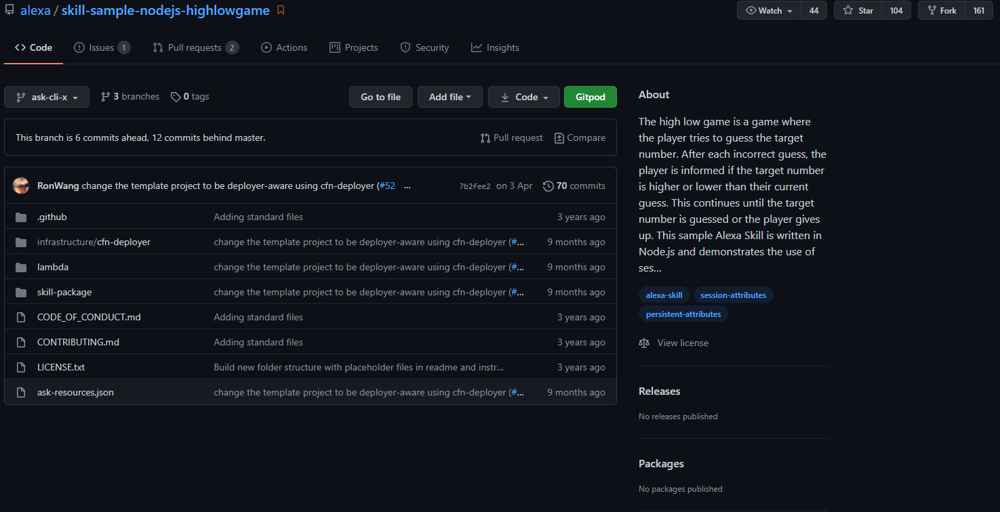

# Alexa Skill Auto-Deployer

Imagine that you find a template of an Alexa Skill on the internet and want to try it immediately. Well, this is possible thanks to this new tool called Alexa Skill Auto-Deployer.
These steps are automated using the continuous integration system circleCI and are executed using its official API.
<!-- TOC -->

- [Alexa Skill Auto-Deployer](#alexa-skill-auto-deployer)
  - [Prerequisites](#prerequisites)
  - [ASK CLI (Alexa Skill Kit CLI)](#ask-cli-alexa-skill-kit-cli)
    - [Installation](#installation)
  - [CircleCI](#circleci)
  - [Automation Process](#automation-process)
    - [Setting up the parameters](#setting-up-the-parameters)
    - [Setting up the executor](#setting-up-the-executor)
    - [Checkout](#checkout)
    - [Creating an Alexa Hosted Skill](#creating-an-alexa-hosted-skill)
    - [Downloading the template](#downloading-the-template)
    - [Deploy the Alexa Skill with all changes](#deploy-the-alexa-skill-with-all-changes)
    - [Full Pipeline Job](#full-pipeline-job)
  - [Invocation & Usage](#invocation--usage)
    - [Example](#example)
  - [Resources](#resources)
  - [Conclusion](#conclusion)

<!-- /TOC -->

## Prerequisites

Here you have the technologies used in this project
1. ASK CLI - [Install and configure ASK CLI](https://developer.amazon.com/es-ES/docs/alexa/smapi/quick-start-alexa-skills-kit-command-line-interface.html)
2. CircleCI Account - [Sign up here](https://circleci.com/)
3. Visual Studio Code

## ASK CLI (Alexa Skill Kit CLI)

The Alexa Skills Kit Command Line Interface (ASK CLI) is a tool for you to manage your Alexa skills and related resources, such as AWS Lambda functions.
With ASK CLI, you have access to the Skill Management API, which allows you to manage Alexa skills programmatically from the command line.
We will use this powerful tool to auto-deploy our Alexa Skill template. Let's start!

### Installation

We need to install the ASK CLI and some other bash tools like `git`, `expect` or `curl`. Don't worry, I prepared for you a Docker Image where all those tools are [included](https://hub.docker.com/repository/docker/xavidop/alexa-ask-aws-cli).
We will use this Docker Image as a main executor in all the steps of the CircleCI Pipeline.
## CircleCI

CircleCi is one of the most powerful and used CI CD platforms of the world. CircleCI integrates with GitHub, GitHub Enterprise, and Bitbucket. Every time you commit code, CircleCI creates and executes a pipeline. CircleCI automatically runs your pipeline in a clean container or virtual machine, allowing you to test every commit.
Additionally, it has a very powerful API which we will use in this tutorial.

## Automation Process

Let's explain job by job what is happening in our powerful pipeline. 


### Setting up the parameters

First of all, you have to know that we are going to use the CircleCI API so because of that, we will create some parameters to make this process reusable:


**NOTE:** If you want to run successfully every ASK CLI command, you have to set up these parameters properly:

* `ASK_ACCESS_TOKEN`: the Alexa Access Token generated.
* `ASK_REFRESH_TOKEN`: the Alexa refresh token generated as well.
* `ASK_VENDOR_ID`: your Vendor ID.
* `ASK_VERSION`: the version of the ASK CLI you want to use. You can find all the versions available [here](https://hub.docker.com/repository/docker/xavidop/alexa-ask-aws-cli/). By default, 2.0.
* `GIT_TEMPLATE_URL`: the Alexa Skill template you want to deploy in your AWS Account. This parameter must be a git repo url. Example: https://github.com/alexa/skill-sample-nodejs-highlowgame.git
* `GIT_BRANCH`: the branch of the Alexa skill template git repo you want to use. By default, master.
* 
How to obtain the ASK CLI related variables are explained in [this post](https://dzone.com/articles/docker-image-for-ask-and-aws-cli-1)

Here you have the parameters section of the CircleCI pipeline:
```yaml
  parameters:
    ASK_ACCESS_TOKEN:
        type: string
        default: ""
    ASK_REFRESH_TOKEN:
        type: string
        default: ""
    ASK_VENDOR_ID:
        type: string
        default: ""
    ASK_VERSION:
        type: string
        default: "2.0"
    GIT_TEMPLATE_URL:
        type: string
        default: ""
    GIT_BRANCH:
        type: string
        default: "master"

```

### Setting up the executor

We have to define in our pipeline the executor that we are going to execute. This executor will be a Docker Image we have created and have installed the ASK CLI and AWS CLI.

These executor has more bash tools intalled as well. This Docker Image have a tag per ASK CLI version, so you can specify the version with the pipeline parameter `ASK_VERSION`.

You can find all the ASK CLI versions supported [here](https://hub.docker.com/repository/docker/xavidop/alexa-ask-aws-cli/tags).

```yaml
  executors:
    ask-executor:
        docker:
        - image: xavidop/alexa-ask-aws-cli:<< pipeline.parameters.ASK_VERSION >>

```

### Checkout

The second thing we need to do is download the code of this repo because there are some script that we are going to execute in this pipeline.

Once downloaded, we will add the execution permissions for those scripts to be able to run them properly.
Finally, we persist all the code downloaded in order to reuse it in the next steps.

```yaml
  checkout:
    executor: ask-executor
    environment:
      ASK_ACCESS_TOKEN: << pipeline.parameters.ASK_ACCESS_TOKEN >>
      ASK_REFRESH_TOKEN: << pipeline.parameters.ASK_REFRESH_TOKEN >>
      ASK_VENDOR_ID: << pipeline.parameters.ASK_VENDOR_ID >>
      ASK_VERSION: << pipeline.parameters.ASK_VERSION >>
      GIT_TEMPLATE_URL: << pipeline.parameters.GIT_TEMPLATE_URL >>
      GIT_BRANCH: << pipeline.parameters.GIT_BRANCH >>
    steps:
      - checkout
      - run: chmod +x -R ./create_hosted_skill_v2.sh
      - run: chmod +x -R ./create_hosted_skill_v1.sh
      - run: chmod +x -R ./deploy_hosted_skill_v1.sh
      - persist_to_workspace:
          root: /home/node/
          paths:
            - project
            - .ask
```

### Creating an Alexa Hosted Skill

This is where the magic starts. Once we have downloaded all the code, we will create a new Alexa Hosted Skill. 

For this process we will use the bash tool `expect`. This is because the creation of the Alexa Hosted Skill requires interaction with a keyboard.

These scripts works like this: they will expect some known strings and then, they will introduce a value or they will just simulate pressing the enter key(`\r`) automatically. Depending on the input needed in the creation process.

1. For **ASK CLI 1.x** version:
```bash
#!/usr/bin/expect

set timeout 6000

spawn ask create-hosted-skill
expect "Please type in your skill name"
send -- "template\r"
expect "Please select the runtime"
send -- "\r"
expect "Alexa hosted skill is created. Do you want to clone the skill"
send -- "\r"
expect "successfuly cloned."
```

2. For **ASK CLI 2.x** version:
```bash
#!/usr/bin/expect

set template [lindex $argv 0];

set timeout 6000

spawn ask new 
expect "Choose the programming language you will use to code your skill"
send -- "\r"
expect "Choose a method to host your skill's backend resources"
send -- "\r"
expect "Choose the default locale for your skill"
send -- "\r"
expect "Choose the default region for your skill"
send -- "\r"
expect "Please type in your skill name:"
send -- "${template}\r"
expect "Please type in your folder name"
send -- "../template\r"
expect "Hosted skill provisioning finished"
```

The scripts above will create a HelloWorld skill:



One important thing here is that in this step we are going to set the environment variables in the executor which are needed to run the Alexa Hosted ASK CLI creation command. The values of this environment variables will be the ones received as parameters.

Here you can find the full code of this job:

```yaml
  create_hosted_skill:
    executor: ask-executor
    environment:
      ASK_ACCESS_TOKEN: << pipeline.parameters.ASK_ACCESS_TOKEN >>
      ASK_REFRESH_TOKEN: << pipeline.parameters.ASK_REFRESH_TOKEN >>
      ASK_VENDOR_ID: << pipeline.parameters.ASK_VENDOR_ID >>
      ASK_VERSION: << pipeline.parameters.ASK_VERSION >>
      GIT_TEMPLATE_URL: << pipeline.parameters.GIT_TEMPLATE_URL >>
      GIT_BRANCH: << pipeline.parameters.GIT_BRANCH >>
    steps:
      - attach_workspace:
          at: /home/node/
      - run: 
          name: create hosted skill
          command: |
            base_file=$(basename $GIT_TEMPLATE_URL)
            repo_folder=${base_file%.*} 
            
             if [ "$ASK_VERSION" == "1.0" ]; then
              ./create_hosted_skill_v1.sh $repo_folder
            else
             ./create_hosted_skill_v2.sh $repo_folder
            fi           
      - persist_to_workspace:
          root: /home/node/
          paths:
            - project
            - .ask
```

### Downloading the template

Now we have an Alexa Hosted Skill (which is a HelloWorld Skill) created and deployed with an ARN. It is time to download the Alexa Skill Template set as a parameter. This template must be a git repository.
You can specify the branch of the git template repo. If it is not specified, by default we will use the master branch.

When we have downloaded the template of the Alexa Skill, now we have to merge both skills (the helloWorld created in the previous step and the one downloaded recently).

This is because the Alexa Skill template we do not know how its structured and which `deployer` is using (Alexa Hosted, CloudFormation or AWS-lambda). This is why we are doing this step which is the most important!

So once we have mentioned the reasons to execute this step. Let's explain step by step this job:
1. The first thing that we are going to do is to clean up the HelloWorld Skill created before. It means remove the interaction model and its lambda code.
2. Then depending of the ASK CLI Vvrsion you have chosen, we will migrate all the info of the Alexa Skill template to the HelloWorld Skill:
   1. For **ASK CLI 1.x** version:
      1. For this version which is deprecated we only merge the following things of the Alexa Skill template:
         1. The publishing information.
         2. The lambda code.
      2. We also remove the `.ask` and `.git` folder of the downloaded Alexa Skill template.
   2. For **ASK CLI 2.x** version:
      1. We get all the endpoints and regions information of the Helloworld Skill and put that info in the downloaded Alexa Skill template.
      2. We remove the `.ask` and `.git` folder of the downloaded Alexa Skill template.
      3. Then we replace the lambda code, skill-package and all the skill metadata with the ones downloaded in the template. 

In this step we set the environment variables as well.

Here you can find the full code of this job:

```yaml
  download_template:
    executor: ask-executor
    environment:
      ASK_ACCESS_TOKEN: << pipeline.parameters.ASK_ACCESS_TOKEN >>
      ASK_REFRESH_TOKEN: << pipeline.parameters.ASK_REFRESH_TOKEN >>
      ASK_VENDOR_ID: << pipeline.parameters.ASK_VENDOR_ID >>
      ASK_VERSION: << pipeline.parameters.ASK_VERSION >>
      GIT_TEMPLATE_URL: << pipeline.parameters.GIT_TEMPLATE_URL >>
      GIT_BRANCH: << pipeline.parameters.GIT_BRANCH >>
    steps:
      - attach_workspace:
          at: /home/node/
      #removing ask cli template lambda + skill-packages
      - run: 
          name: cleanup skill created
          command: | 
            rm -rf template/lambda/

            if [ "$ASK_VERSION" == "1.0" ]; then
              rm -rf template/models
            else
              rm -rf template/skill-package/interactionModels
            fi           
      - run: git clone -b $GIT_BRANCH $GIT_TEMPLATE_URL
       #cleanup template downloaded metada, getting only lambda + skill-packages objeects 
       #copy downloaded template fully cleaned to final template to push
      - run: 
          name: merge donwloaded template
          command: |
            base_file=$(basename $GIT_TEMPLATE_URL)
            repo_folder=${base_file%.*}

            rm -rf $repo_folder/.git 
            if [ "$ASK_VERSION" == "1.0" ]; then
              info=$(cat $repo_folder/skill.json | jq -rc .manifest.publishingInformation)
              skill_info=$(jq -rc --argjson info "$info" '.manifest.publishingInformation = $info' template/skill.json)
              echo $skill_info > template/skill.json

              dir=$(cat $repo_folder/skill.json | jq -r .manifest.apis.custom.endpoint.sourceDir)

              rm -rf $repo_folder/.ask
              rm -rf $repo_folder/skill.json
              cp -R $repo_folder/. template/
              
              if [ "$dir" != "lambda/" ]; then
                cp -R  template/${dir}/. template/lambda/
                rm -rf template/${dir}
              fi
            else
               endpoint=$(cat template/skill-package/skill.json | jq -rc .manifest.apis.custom.endpoint)
               regions=$(cat template/skill-package/skill.json | jq -rc .manifest.apis.custom.regions)
               
               skill_info=$(jq -rc --argjson endpoint "$endpoint" '.manifest.apis.custom.endpoint = $endpoint' $repo_folder/skill-package/skill.json)
               echo $skill_info > $repo_folder/skill-package/skill.json
               skill_info=$(jq -rc --argjson regions "$regions" '.manifest.apis.custom.regions = $regions' $repo_folder/skill-package/skill.json)
               echo $skill_info > $repo_folder/skill-package/skill.json

               dir=$(cat $repo_folder/ask-resources.json | jq -r .profiles.default.code.default.src)

               rm -rf $repo_folder/.ask 
               rm -rf $repo_folder/ask-resources.json 
               cp -R $repo_folder/. template/
              
               if [ "$dir" != "./lambda" ]; then
                cp -R  template/${dir}/. template/lambda/
                rm -rf template/${dir}
               fi
            fi
            
      - persist_to_workspace:
          root: /home/node/
          paths:
            - project
            - .ask
```

### Deploy the Alexa Skill with all changes

At this moment we have our first HelloWorld Alexa Hosted Skill successfully merged with the downloaded Alexa Skill template. Now it is time to deploy the changes.

Depending on the version of the ASK CLI version, it will execute one commands or another:
1. For **ASK CLI 1.x** version:
   1. We will execute another `expect` script. In this case we will execute `deploy_hosted_skill_v1.sh`:
   ```bash
    #!/usr/bin/expect

    set timeout 6000

    spawn ask deploy --force
    expect "Do you want to proceed with the above deployments"
    send -- "\r"
    expect "Your skill code deployment has started"
   ```
2. For **ASK CLI 2.x** version:
   1. We will just run: `git push origin master`

In this step we set the environment variables as well.

Here you can find the full code of this job:

```yaml
  deploy_hosted_skill:
    executor: ask-executor
    environment:
      ASK_ACCESS_TOKEN: << pipeline.parameters.ASK_ACCESS_TOKEN >>
      ASK_REFRESH_TOKEN: << pipeline.parameters.ASK_REFRESH_TOKEN >>
      ASK_VENDOR_ID: << pipeline.parameters.ASK_VENDOR_ID >>
      ASK_VERSION: << pipeline.parameters.ASK_VERSION >>
      GIT_TEMPLATE_URL: << pipeline.parameters.GIT_TEMPLATE_URL >>
      GIT_BRANCH: << pipeline.parameters.GIT_BRANCH >>
    steps:
      - attach_workspace:
          at: /home/node/
      #init some git global variables
      - run: git config --global user.email "you@example.com"
      - run: git config --global user.name "Your Name"
      #push the final skill
      - run: 
          name: deploy
          command: |
            cd template/
            echo "" >> .gitignore
            echo "deploy_hosted_skill_v1.sh" >> .gitignore
            git add . 
            git commit -m "template added" 
            if [ "$ASK_VERSION" == "1.0" ]; then
              cp ../deploy_hosted_skill_v1.sh ./  
              ./deploy_hosted_skill_v1.sh
            else
              git push origin master
            fi
      - store_artifacts:
          path: ./
```

Finally, our HelloWorld skill will transform into the downloaded Alexa Skill template:



### Full Pipeline Job

Here you can find the pipeline specification with all the jobs commented above:

```yaml
  workflows:
    skill-pipeline:
        jobs:
        - checkout
        - create_hosted_skill:
            requires:
                - checkout
        - download_template:
            requires:
            - create_hosted_skill
        - deploy_hosted_skill:
            requires:
            - download_template
```

**NOTE:** all the CircleCI config files are located on `.circleci` folder.
## Invocation & Usage

Now the automation process is fully explained. Let's start explaining how to use it using the CircleCI API.

It is important to mention that all the credentials are not be stored in any place. We will use it only for the automation process. Please check the source code if you have some doubts.

This is how the pipeline can be called using the CircleCI pipeline:
```bash
 curl --request POST \
      --url https://circleci.com/api/v2/project/<your-vcs>/<your-username>/<your-repo-name>/pipeline?circle-token=<your-circle-ci-token> \
      --header 'content-type: application/json' \
      --data-binary @- << EOF  
      { 
        "parameters": { 
            "ASK_ACCESS_TOKEN": "your-access-token", 
            "ASK_REFRESH_TOKEN": "your-refresh-token", 
            "ASK_VENDOR_ID": "your-vendor-id", \
            "GIT_TEMPLATE_URL": "the-git-template-url", 
            "GIT_BRANCH": "the-git-template-branch", 
            "ASK_VERSION": "ask-cli-version" 
        } 
    }
    EOF
```

### Example

Imagine that we want to deploy this template https://github.com/alexa/skill-sample-nodejs-highlowgame.git as an Alexa Hosted Skill in our AWS Account:



The REST call will be like these ones:
1. For **ASK CLI 1.x** version:
```bash
 curl --request POST \
      --url https://circleci.com/api/v2/project/github/xavidop/alexa-skill-autodeployer/pipeline?circle-token=a96e83d347a52c19d2b38dd981f3fc2fa0217f7e \
      --header 'content-type: application/json' \
      --data-binary @- << EOF 
      { 
        "parameters": { 
            "ASK_ACCESS_TOKEN": "your-access-token", 
            "ASK_REFRESH_TOKEN": "your-refresh-token", 
            "ASK_VENDOR_ID": "your-vendor-id", 
            "GIT_TEMPLATE_URL": "https://github.com/alexa/skill-sample-nodejs-highlowgame.git", 
            "GIT_BRANCH": "master", 
            "ASK_VERSION": "1.0" 
        } 
    }
    EOF
```

2. For **ASK CLI 2.x** version:
```bash
 curl --request POST \
      --url https://circleci.com/api/v2/project/github/xavidop/alexa-skill-autodeployer/pipeline?circle-token=a96e83d347a52c19d2b38dd981f3fc2fa0217f7e \
      --header 'content-type: application/json' \
      --data-binary @- << EOF 
      { 
        "parameters": { 
            "ASK_ACCESS_TOKEN": "your-access-token", 
            "ASK_REFRESH_TOKEN": "your-refresh-token", 
            "ASK_VENDOR_ID": "your-vendor-id", 
            "GIT_TEMPLATE_URL": "https://github.com/alexa/skill-sample-nodejs-highlowgame.git", 
            "GIT_BRANCH": "ask-cli-x", 
            "ASK_VERSION": "2.0" 
        } 
    }
    EOF
```


## Resources
* [DevOps Wikipedia](https://en.wikipedia.org/wiki/DevOps) - Wikipedia reference
* [Official Alexa Skill Management API Documentation](https://developer.amazon.com/es-ES/docs/alexa/smapi/skill-testing-operations.html) - Alexa Skill Management API Documentation
* [Official CircleCI Documentation](https://circleci.com/docs/) - Official CircleCI Documentation
* [Official CircleCI API Documentation](https://circleci.com/docs/api/v2/) - Official CircleCI API Documentation

## Conclusion 

Thanks to the ASK CLI we can perform this complex task.

I hope this tool is useful to you.

You can use this tool, for example, for the following use cases:
1. Add a button in your Alexa Skill templates git repos automatically deploy them in your AWS account.
2. Add a button in your webpage that performs a call to this process.
3. Transform you Self Hosted skills into Alexa Hosted ones.
4. Trying new Alexa skills and keep learning!

That's all folks!

Happy coding!